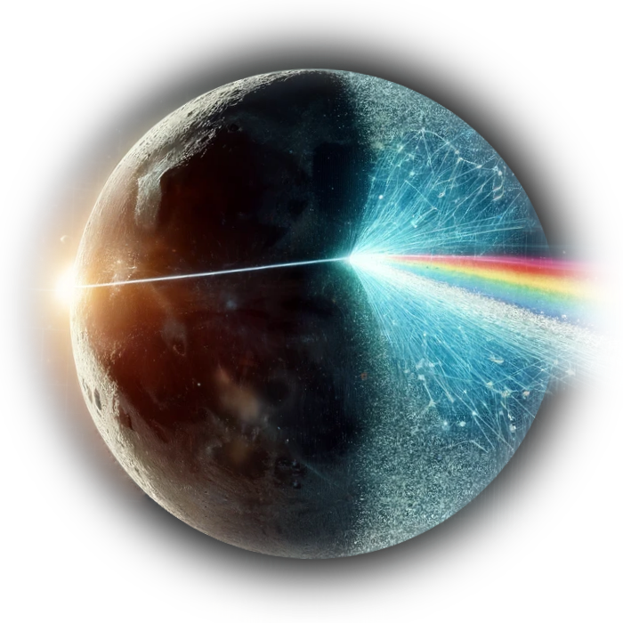

# Data Side of the Moon

## Decoding Pink Floyd’s Legacy

<i>artwork generated by DALL·E 3</i>

## Introduction

How can computer "precieve" music? How we, human, understand music? From a higher perspective, the process of precieve music is consist of 3 main steps: we hear(encode), we understand, and (if we want) we sing(decode) and then we hear (again). Base on this idea, we implement a neural network based on **convolutional autoencoder architecture**, and then explore the **learning representation of music**.

The key idea of this project is using **unsupervised learning** to explore music, which should be distinguished from <u>music genres classification tasks</u> which we consider has its own limitation due to the labels(genres) are limited by human ourselves. We believe that generes always falls behind music.

## Model "Echoes"

"Echoes" model architecture

"Echoes" model training

Latent vectors of GTZAN testset

## Pink Floyd

PF albums - clusters - years

## Discussion and future work

- open world (classify things to unknown classes)

